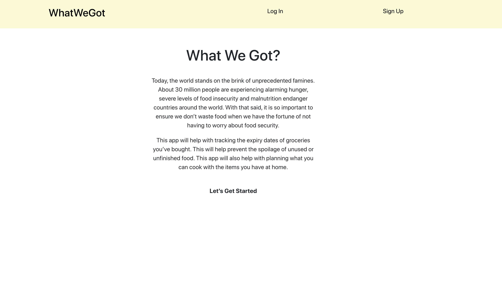
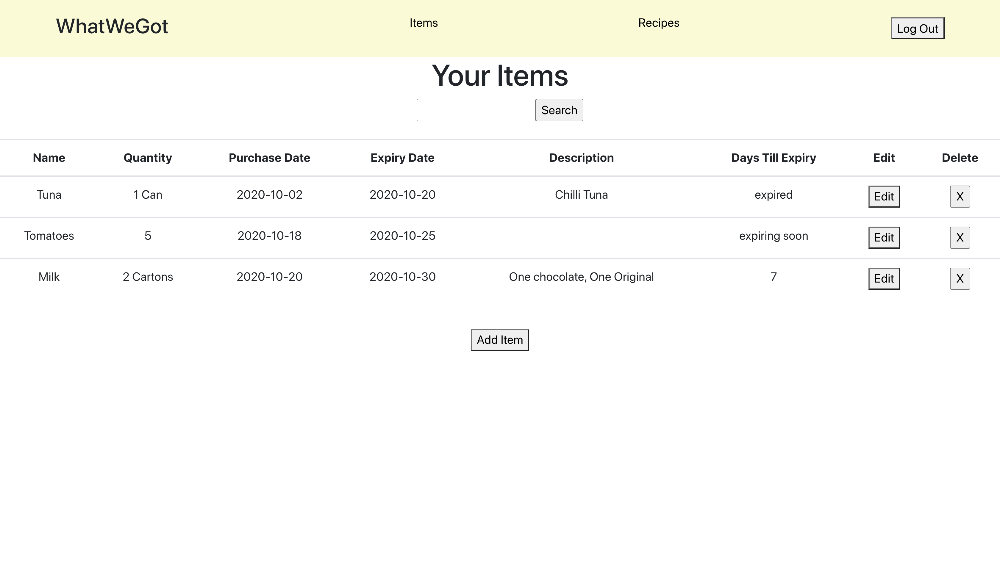
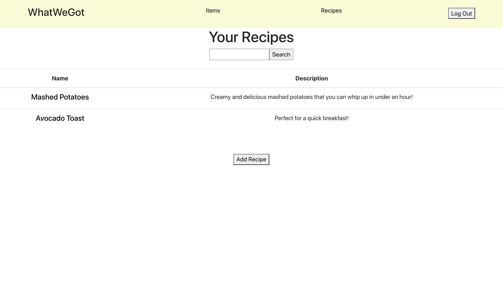

# WhatWeGot

## URL 

<a href="http://whatwegot.herokuapp.com">http:// whatwegot.herokuapp.com</a>

## Quick Jump
* [Description](#description)
* [Technology](#technologies-used)
* [Screenshots](#screenshots)

## Description

An app to easily track the groceries you have bought and their expiry dates. 

Today, the world stands on the brink of unprecedented famines. About 30 million people are experiencing alarming hunger, severe levels of food insecurity and malnutrition affect countries around the world. 

With that said, it is so important to ensure we don’t waste food when we have the fortune of not having to worry about food security.

## Technologies Used

- PostgreSQL (Database)
- Express (Backend)
- React (Frontend)
- Node.js (Backend)
- Bootstrap (Frontend)

## Screenshots

#### Home

#### Items

#### Recipes

